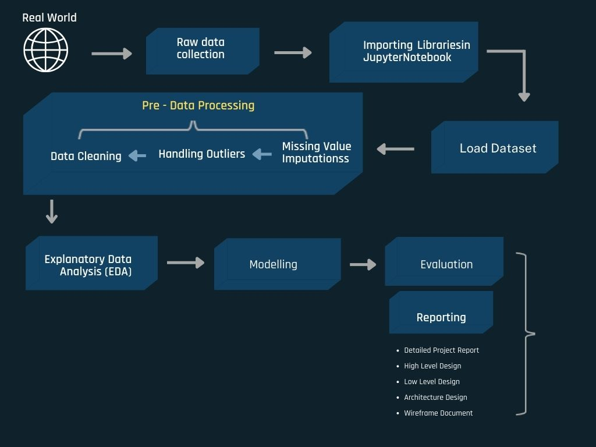

# PROJECT DETAIL:

* Tech Stack- Python and Machine Learning
* Domain- Healthcare
* Project level- Rookie
* Programming language- Python
* Tools- Jupyter Notebook/ Any IDE 

# OBJECTIVE
 
> The goal of this project is to predict whether 
> an expecting pregnant woman will deliver her baby through c-section mode or through normal delivery

### BACKGROUND AND SCOPE

> As and when pregnant women near the date of delivery, it becomes a challenge to the treating gynaecologist to wait for normal delivery  to take place. Hence, they induce pain (by administering some injection) and speed up the delivery process. However, sometimes the induction fails. Even though it is successful, there is no guarantee that there will be a normal delivery.

> Analyze the different factors that influence the delivery mode and come out with a predictive model which can help the treating doctors to find out whether a given sample (expecting woman) will give birth to her baby through C-Section or Normal Delivery mode

# BENEFITS

> Gives doctors prior information about the mode of delivery and all medical arrangements can be made before hand and also prepare (mentally and physically)  the expecting woman to undergo c-section delivery

### ARCHITECTURE 

